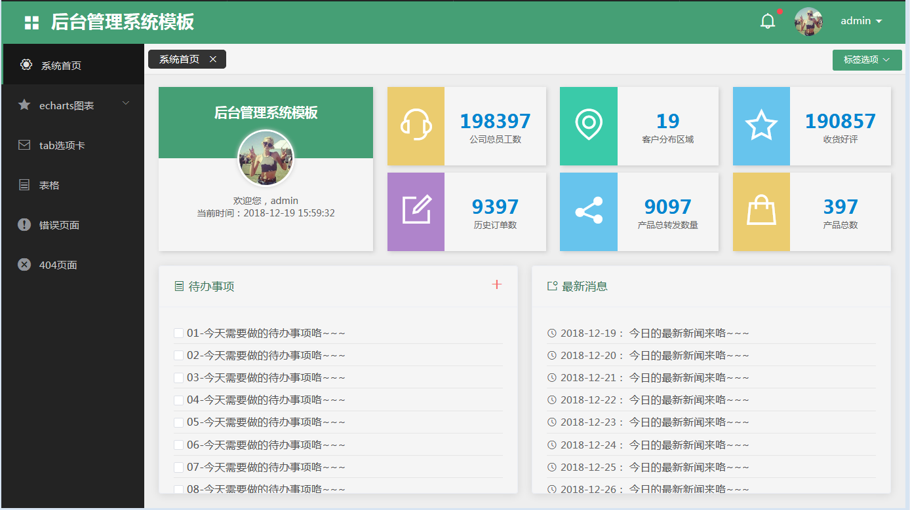

# 前言
**vue2-elementui-admin**项目是基于vue全家桶和elementui完成的PC端后台管理系统模板。[最新后台管理系统模板（使用vue2全家桶、element-ui、echarts、axios等）](https://gitee.com/nut77/vue2-elementui-layout)。
# 技术栈
less es6 vue2 vuex vue-router element-ui webpack echarts
# 项目运行
**注意：项目是基于nodejs运行，需要提前安装好nodejs环境。**

```
git clone 项目地址
cd vue2-elementui-admin
npm install
npm run dev
npm run build
```
然后访问```localhost:8080```即可进入登录页面（用户名和密码可随便填，但不能为空）。
# 部分截图
#### 登录

#### 系统首页



#### 简单图表

#### 复杂图表

#### tab选项卡


#### 表格


#### 错误页面

#### 404页面
